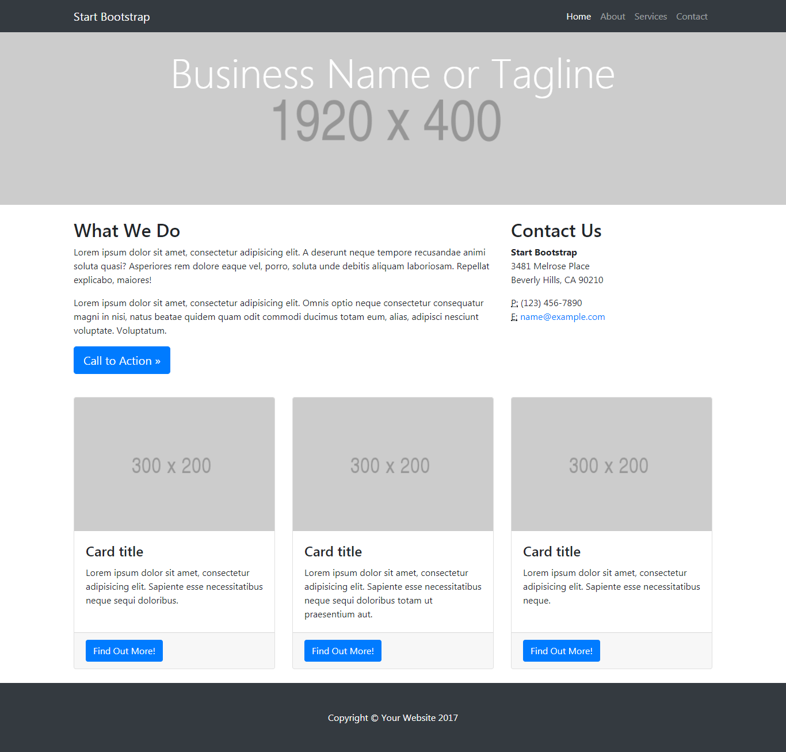

# Reto
* **Track:** _Common Core_
* **Curso:** _Crea tu propia red social_
* **Unidad:** _La web desde un móvil_

---

#### Enunciados

A continuación tienes algunos ejercicios de práctica que serán resueltos, paso a paso, por tu equipo de profes en una sesión presencial (taller). Te sugerimos que intentes resolver los ejercicios por tu cuenta (o en equipo) antes de la sesión presencial. Así, ya vienes con dudas específicas y estarás familiarizada con los retos. Quizás, puedas tú presentar tu solución ante la clase y así ayudar al resto de tus compañeras :)

Debes subir todos tus ejercicios a GitHub y publicarlos en gh-pages.

**2. Mi página**

En este reto, vamos a realizar una página a nuestro gusto.

El diseño lo puedes realizar como mejor te parezca, pero debes mantener la estructura de la página y debes realizarlo con un grid (cualquiera pero que no sea un framework como Bootstrap o Materialize). La estructura de la página es la siguiente:

##### Herramientas utilizadas:
* Sistema de Grillas
* Diseño Web Responsive
* CSS3
* HTML5

